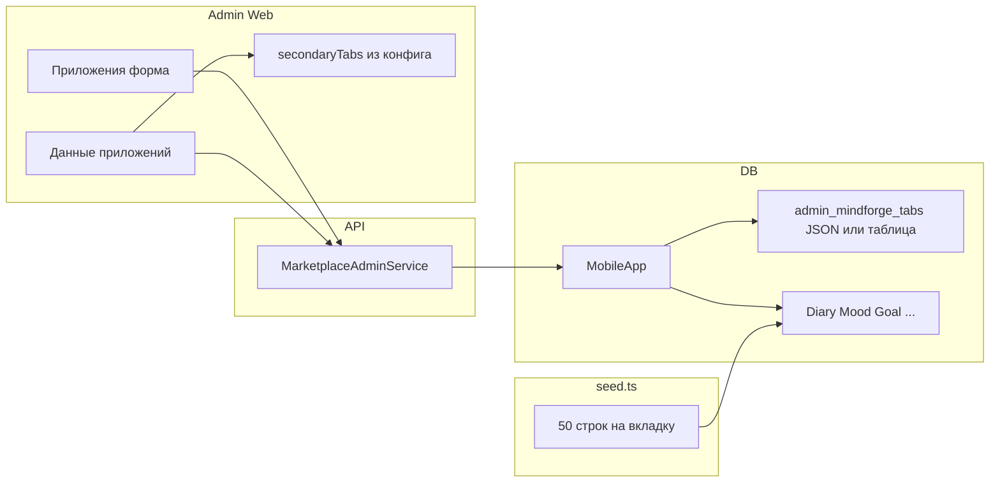

---
name: Конфиг вкладок и seed
overview: "Ввести хранение набора вторичных вкладок (сущностей MindForge) на приложение, API и форму в админке «Приложения», динамическую подгрузку вкладок в «Данные приложений», и расширить Prisma seed: по 50 записей на каждую сущность для seed-приложений с учётом FK-зависимостей."
todos:
  - id: prisma-config
    content: "Prisma: поле/таблица конфигурации вкладок на MobileApp + миграция"
    status: completed
  - id: proto-marketplace
    content: Расширить marketplace.proto (detail/update) + buf generate + Nest маппинг и валидация
    status: completed
  - id: admin-apps-form
    content: Секция конфигурации вкладок в applications + API service
    status: completed
  - id: app-data-shell-dynamic
    content: "app-data-shell: загрузка конфига по appId, dynamic secondaryTabs + coerce URL"
    status: completed
  - id: seed-50-per-tab
    content: "seed.ts: 50 строк на сущность для seed-приложений, порядок FK, идемпотентность"
    status: completed
  - id: todo-1778270097872-3fdhk0mdv
    content: улучши дизайн формы. выровняй фильтры. описаниясплывающие подсказки
    status: completed
isProject: false
---

# План: вкладки на приложение, форма конфигурации, seed по 50 записей

## Контекст (как сейчас)

- Вторичные вкладки (дневники, настроение, …) задаются в [`app-data-shell.ts`](psyconsallt/libs/web/admin/src/lib/features/mindforge/app-data-shell.ts) методом `secondaryTabs()` по фиксированным спискам из [`app-data.types.ts`](psyconsallt/libs/web/admin/src/lib/features/mindforge/app-data.types.ts) (`USER_ENTITIES`, `CONTENT_ENTITIES`, `DICT_ENTITIES`).
- Приложения — модель [`MobileApp`](psyconsallt/libs/api/shared/prisma/schema.prisma); админка уже ходит в [`MarketplaceAdminService`](psyconsallt/libs/shared/api-contracts/proto/psyconsallt/marketplace/v1alpha1/marketplace.proto) (`GetMobileApp` / `UpdateMobileApp` и т.д.).
- Seed: [`libs/api/shared/prisma/seed.ts`](psyconsallt/libs/api/shared/prisma/seed.ts) + каталог [`data/seed-mobile-apps.json`](psyconsallt/libs/api/shared/prisma/data/seed-mobile-apps.json); вставки MindForge-таблиц для демо-данных сейчас по сути отсутствуют.

**Выбор пользователя:** настраиваются только **вторичные** вкладки (сущности) внутри трёх групп; группы «пользовательские данные / контент / словарь» остаются как сейчас (в т.ч. левое меню).

## 1. Модель данных (Prisma)

- Добавить на `MobileApp` поле для конфигурации, например **`adminMindforgeTabConfig Json`** (или отдельная таблица `mobile_app_admin_mindforge_tab` с строками `app_id`, `group`, `entity`, `sort_order`, `enabled` — если нужны индексы и миграции без «магии» JSON). Для первой итерации достаточно **одного Json** с контрактом вида:
  - `user: [{ entity: "diary", label?: string, order: number, enabled: boolean }, ...]`
  - `content`, `dict` — аналогично.
- **Обратная совместимость:** если поле `null` или пустой объект — UI и API используют **текущие дефолты** из [`app-data.types.ts`](psyconsallt/libs/web/admin/src/lib/features/mindforge/app-data.types.ts) (как сейчас).
- Валидация на API: только значения из разрешённого перечня сущностей (совпадает с `AppDataEntity` / списками по группам), без дубликатов `entity` в одной группе, порядок по `order`.

## 2. Контракт API (Buf / marketplace)

- Расширить сообщения в [`marketplace.proto`](psyconsallt/libs/shared/api-contracts/proto/psyconsallt/marketplace/v1alpha1/marketplace.proto):
  - в **`AdminMobileAppDetail`** (и при необходимости в summary) добавить поле с конфигом (например `MindforgeAdminTabConfig` с `repeated MindforgeAdminTabGroup groups` или сериализованный JSON как `string` — предпочтительно **typed proto** для стабильности клиента);
  - в **`MarketplaceAdminServiceUpdateMobileAppRequest`** — опциональное обновление этого поля (частичный патч или «заменить целиком блок вкладок» — зафиксировать одно поведение в реализации).
- Прогнать `buf generate`, обновить Nest-сервис маркетплейса (маппинг Prisma ↔ proto), тесты при наличии.

## 3. Backend (Nest + Prisma)

- Миграция Prisma для нового поля/таблицы.
- В сервисе обновления приложения: валидация структуры, нормализация (сортировка, дефолтные подписи можно подставлять на сервере или оставить только на фронте — в плане заложить **серверную** валидацию enum-сущностей).
- **Не** дублировать бизнес-логику списка сущностей в двух местах: вынести на бэкенд (или в общий TS-пакет, если уже есть паттерн) константы допустимых `entity` по `group`, чтобы фронт и API не разошлись.

## 4. Форма конфигурации в админке «Приложения»

- В [`applications.ts` / `applications.html`](psyconsallt/libs/web/admin/src/lib/features/applications/) в модалке редактирования/деталей приложения добавить секцию **«Вкладки админки MindForge»**:
  - три блока (user / content / dict) со списком чекбоксов/переключателей по сущностям из текущих констант + **drag-and-drop порядка** (опционально во 2-й итерации: сначала чекбоксы + числовой order).
  - Кнопка «Сбросить к умолчанию».
- Расширить [`admin-marketplace-apps-api.service.ts`](psyconsallt/libs/web/admin/src/lib/features/applications/admin-marketplace-apps-api.service.ts) под новые поля в `Get`/`Update`.

## 5. «Данные приложений» — динамические вторичные вкладки

- В [`app-data-shell.ts`](psyconsallt/libs/web/admin/src/lib/features/mindforge/app-data-shell.ts):
  - при смене **`appId`** в query (или при инициализации) загружать деталь приложения (уже есть marketplace API) и кэшировать **разрешённые сущности по группам**;
  - `secondaryTabs()` строить из конфига + дефолта; подписи — из существующего `entityTitle()` / мапы или из `label` в конфиге.
- **Согласование URL:** если в URL `entity` не входит в конфиг для текущей `group`, выполнить **редирект** на первую доступную сущность группы (аналог [`coerceEntityForGroup`](psyconsallt/libs/web/admin/src/lib/features/mindforge/app-data.types.ts), но с учётом whitelist).
- Левое меню и три группы **не** меняются; меняется только горизонтальный ряд вторичных вкладок на экране.

## 6. Seed: по 50 записей на каждую вкладку

- Константа, например `SEED_MINDFORGE_ROWS_PER_TAB = 50`.
- Целевые приложения: UUID из [`seed-mobile-apps.json`](psyconsallt/libs/api/shared/prisma/data/seed-mobile-apps.json) (как минимум `mindforge-self-esteem` и при необходимости второе приложение).
- Пользователь для привязки: один из уже создаваемых seed-пользователей (например первый customer), тот же `userId` для всех user-скоуп сущностей.
- **Порядок вставок и зависимости** (иначе FK упадёт):
  - **user:** `DiaryEntry`, `MoodCheckIn` (независимо или с опциональной связью), `Thought`, `Goal` → затем `RelapseEvent` (нужен `goalId`), `Quest` (минимум один на приложение) → `QuestCompletion`, `Skill` (минимум один) → `UserSkillProgress`, `SkillProgressLog`.
  - **content:** `DailyQuote` (50 разных дат на приложение — уникальность [`@@unique([appId, quoteDate])`](psyconsallt/libs/api/shared/prisma/schema.prisma)), `AudioCategory` (несколько) → `AudioAsset` (50 строк суммарно на вкладку «Аудио» или распределение по категориям — зафиксировать правило: например 5 категорий × 10 ассетов).
  - **dict:** `DictionaryCategory` (несколько кодов) → `DictionaryTerm` (50 терминов с уникальными `code` в рамках `appId`).
- **Идемпотентность:** перед массовой вставкой удалять/пропускать по детерминированному префиксу кода/`seedId()` (как в [`seed.ts`](psyconsallt/libs/api/shared/prisma/seed.ts) уже есть `seedId`) чтобы повторный `db:seed` не плодил дубликаты уникальных полей (`@@unique([appId, code])` и т.д.).
- **Связь с конфигом вкладок:** для seed использовать **либо** полный набор сущностей по умолчанию, **либо** только включённые во вкладках после того как конфиг записан в БД (проще: seed всегда заполняет «полный» набор для двух demo-приложений, а конфиг по умолчанию null — тогда админ видит все вкладки; при сужении конфига часть данных просто не отображается). Зафиксировать в реализации один вариант в комментарии к seed.

## 7. Проверки

- `nx run web:build:production` и сборка API / lint затронутых библиотек.
- Ручная проверка: смена конфига у приложения → перезагрузка `/admin/mindforge?appId=...` → видны только выбранные вторичные вкладки; неверный `entity` в URL перекидывает на первую доступную.

## Риски и явные решения

- **Расхождение enum:** держать список допустимых `entity` в одном месте (сервер + генерация/копия для фронта).
- **Тяжёлый GetMobileApp:** для шелла достаточно одного запроса при смене `appId`; при отсутствии прав — graceful fallback на дефолтные вкладки.
- **Prisma `DailyQuote`:** в схеме указаны и `@unique` на `quoteDate`, и `@@unique([appId, quoteDate])` — при миграциях убедиться, что нет конфликта глобальной уникальности даты между приложениями (при необходимости поправить схему в отдельном маленьком PR).
