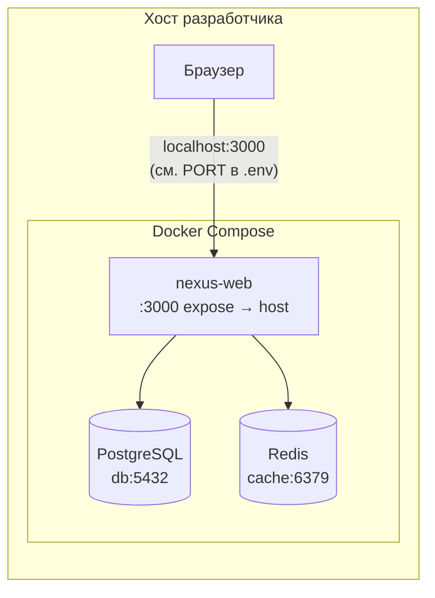
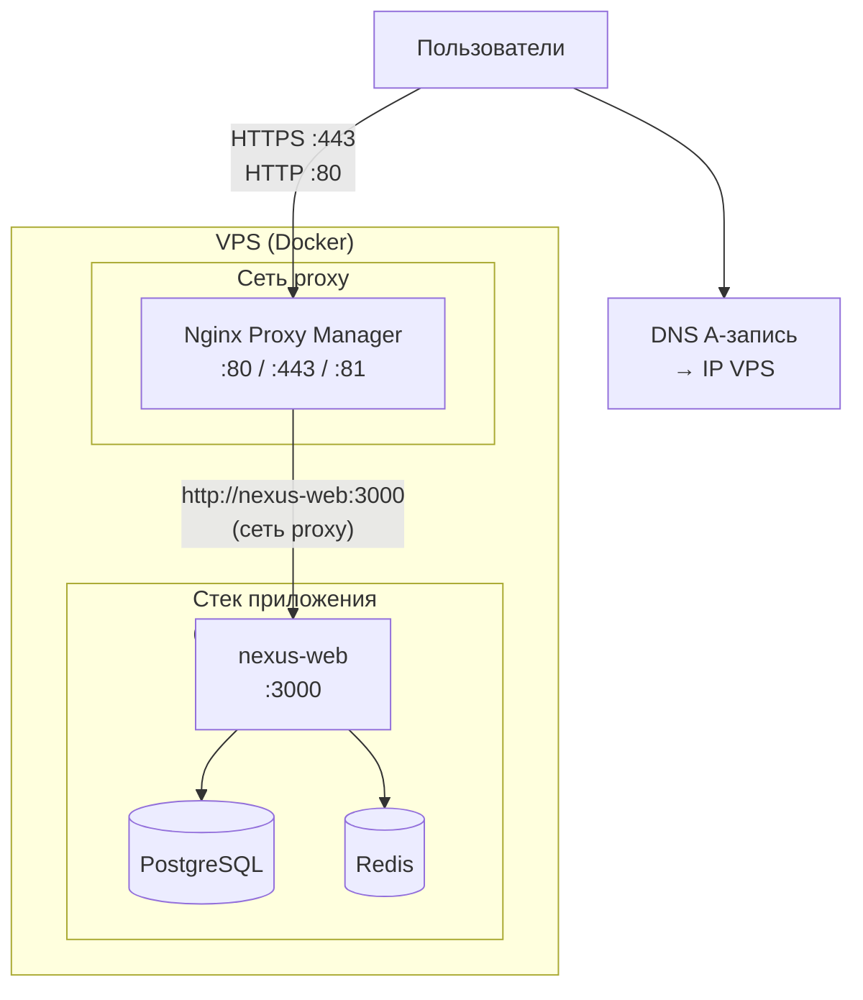

# NexusJS (`nexus-web`) в Docker

## Сборка и запуск

Из корня монорепозитория:

```bash
docker build -f apps/nexus-web/Dockerfile -t nexus-web .
docker run --rm -p 3000:3000 -e NEXUS_SECRET=your-long-random-secret nexus-web
```

BuildKit (Docker 23.0+) подхватывает [Dockerfile.dockerignore](Dockerfile.dockerignore) рядом с этим Dockerfile и ограничивает контекст (корневые манифесты pnpm, `apps/nexus-web`, нужные workspace-пакеты из lockfile). Если ваш клиент не подхватывает его автоматически, укажите явно:  
`docker buildx build --ignorefile apps/nexus-web/Dockerfile.dockerignore -f apps/nexus-web/Dockerfile -t nexus-web .`

## Переменные окружения

| Переменная            | Обязательность                        | Описание                                                                                                          |
| --------------------- | ------------------------------------- | ----------------------------------------------------------------------------------------------------------------- |
| `NEXUS_SECRET`        | Да в production                       | Секрет для server actions и токенов безопасности.                                                                 |
| `PORT`                | Нет                                   | Порт HTTP внутри контейнера (по умолчанию `3000`).                                                                |
| `NODE_ENV`            | Нет                                   | В образе выставлено `production`.                                                                                 |
| `NEXUS_BUILD_ID`      | Рекомендуется в CI на этапе **build** | Передаётся как build-arg, чтобы совпадал build id в HTML и на сервере (меньше 412 `BUILD_MISMATCH` после деплоя). |
| `NEXUS_EXPOSE_ERRORS` | Только отладка                        | Не включать на публичном проде.                                                                                   |

Пример с build id (CI):

```bash
docker build -f apps/nexus-web/Dockerfile -t nexus-web \
  --build-arg NEXUS_BUILD_ID="$(git rev-parse --short HEAD)" .
```

Секреты задавайте через `-e`, Docker secrets или оркестратор; не вшивайте в Dockerfile.

## docker compose

Файл [docker-compose.yml](docker-compose.yml) поднимает приложение вместе с PostgreSQL и Redis; у БД и Redis заданы сетевые алиасы `db` и `cache` для удобства строк подключения в приложении.

Сервис `nexus-web` публикует порт **3000 только внутри сети Docker** (`expose`). Чтобы открыть сайт на хосте при локальной разработке, добавьте оверлей [docker-compose.local.yml](docker-compose.local.yml):

```bash
cd apps/nexus-web
docker compose -f docker-compose.yml -f docker-compose.local.yml up --build
```

Скопируйте [env.example](env.example) в `.env` и задайте `NEXUS_SECRET` перед запуском.

## Схема инфраструктуры

Диаграммы в формате [Mermaid](https://mermaid.js.org/) отображаются на GitHub/GitLab и в предпросмотре Markdown в VS Code / Cursor.

### Локальная разработка (`docker-compose.yml` + `docker-compose.local.yml`)



### VPS за Nginx Proxy Manager (`docker-compose.yml` + `docker-compose.vps.yml` + `docker-compose.npm.yml`)

Сервис `nexus-web` подключён к **двум** сетям: внутренней сети стека приложения (к `postgres` и `redis`) и внешней сети `proxy` (к NPM). Порт **3000** приложения на хост не публикуется.



### VPS: домен → Nginx Proxy Manager → `nexus-web:3000`

Используются отдельный стек NPM и общая Docker-сеть `proxy` (имя фиксировано, чтобы оба compose видели один и тот же интерфейс):

| Файл                                             | Назначение                                                                                                                                                                                |
| ------------------------------------------------ | ----------------------------------------------------------------------------------------------------------------------------------------------------------------------------------------- |
| [docker-compose.npm.yml](docker-compose.npm.yml) | Nginx Proxy Manager на портах хоста **80 / 81 / 443**; тома `./proxy-manager-data`, `./proxy-manager-letsencrypt`; сеть **`proxy`** — **внешняя** (сначала `docker network create proxy`) |
| [docker-compose.vps.yml](docker-compose.vps.yml) | Подключает `nexus-web` к внешней сети `proxy`, чтобы NPM проксировал на **`http://nexus-web:3000`**                                                                                       |

**Один раз** создайте сеть (если её ещё нет):

```bash
docker network create proxy
```

Поднимите NPM (из каталога `apps/nexus-web` на сервере или скопировав эти файлы):

```bash
cd apps/nexus-web
docker compose -f docker-compose.npm.yml up -d
```

Поднимите приложение с оверлеем VPS:

```bash
docker compose -f docker-compose.yml -f docker-compose.vps.yml up -d --build
```

Убедитесь, что **A-запись** домена указывает на IP VPS и с интернета доступны **80** и **443** (для Let's Encrypt).

**Настройка в веб-интерфейсе NPM** (`http://<IP-сервера>:81` после первого запуска; логин по умолчанию см. [документацию NPM](https://nginxproxymanager.com/guide/)):

1. **Hosts** → **Proxy Hosts** → **Add Proxy Host**.
2. **Domain Names**: ваш домен (например `app.example.com`).
3. **Forward Hostname / IP**: `nexus-web` (имя сервиса в compose).
4. **Forward Port**: `3000`.
5. Включите **Block Common Exploits** при желании; на вкладке **SSL** выберите **Request a new SSL Certificate** (Let's Encrypt), согласитесь с условиями, при необходимости включите **Force SSL**.

После сохранения трафик пойдёт: интернет → NPM (443) → контейнер `nexus-web` на порту 3000. Порт 3000 на хост не пробрасывается.

## Запуск контейнера и сеть

Образ собирается с **Corepack** и **pnpm** (нужен доступ к registry на этапе **build**). В **runtime** контейнер стартует через `node` и CLI из `node_modules`, без запросов к `registry.npmjs.org`, плюс задано `COREPACK_ENABLE_DOWNLOAD=0`. Если в логах всё же видите ошибки DNS к внешним хостам при работе самого приложения, настройте DNS для Docker на хосте (например `dns` в `/etc/docker/daemon.json`).
